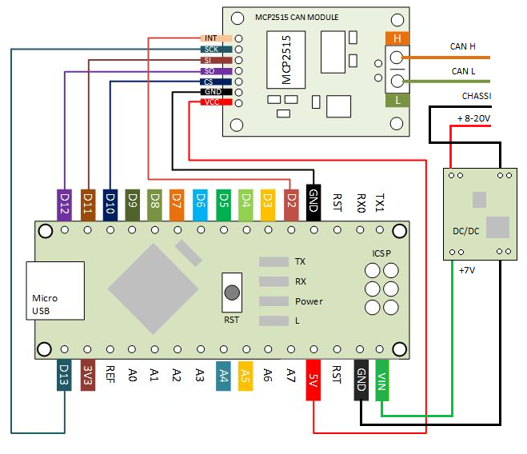
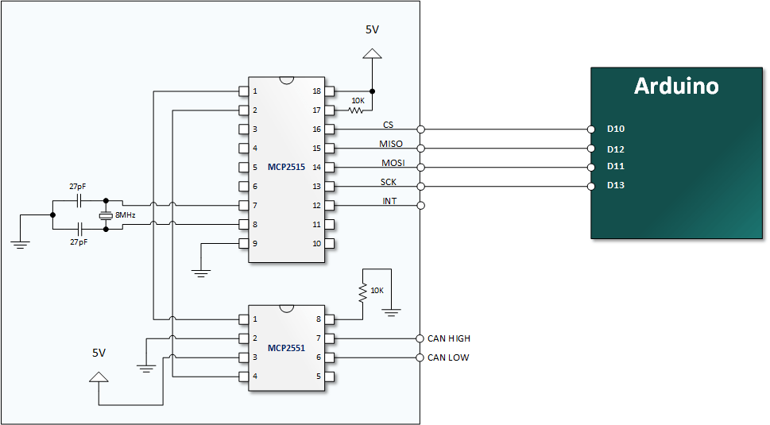

> **📌 This is a fork** of [autowp/arduino-mcp2515](https://github.com/autowp/arduino-mcp2515)
>
> This fork ([brocci/arduino-mcp2515](https://github.com/brocci/arduino-mcp2515)) includes significant improvements:
> - Software TX/RX circular queues to prevent message loss
> - Corrected bit timing values for multiple crystal/baud combinations
> - Enhanced interrupt handling and IRAM optimization for ESP8266 and ESP32
> 
> See [CHANGELOG.md](CHANGELOG.md) for a complete list of changes in v2.0.0+

---

Arduino MCP2515 CAN interface library
---------------------------------------------------------
[](https://github.com/brocci/arduino-mcp2515/actions/workflows/arduino-cli-ci.yml)

<br>
CAN-BUS is a common industrial bus because of its long travel distance, medium communication speed and high reliability. It is commonly found on modern machine tools and as an automotive diagnostic bus. This CAN-BUS Shield gives your Arduino/Seeeduino CAN-BUS capability. With an OBD-II converter cable added on and the OBD-II library imported, you are ready to build an onboard diagnostic device or data logger.

- Implements CAN V2.0B at up to 1 Mb/s
- SPI Interface up to 10 MHz
- Standard (11 bit) and extended (29 bit) data and remote frames
- Two receive buffers with prioritized message storage

**Contents:**
* [Hardware](#hardware)
   * [CAN Shield](#can-shield)
   * [Do It Yourself](#do-it-yourself)
* [Software Usage](#software-usage)
   * [Library Installation](#library-installation)
   * [Initialization](#initialization)
   * [Frame data format](#frame-data-format)
   * [Send Data](#send-data)
   * [Receive Data](#receive-data)
   * [Set Receive Mask and Filter](#set-receive-mask-and-filter)
   * [Examples](#examples)

# Hardware:

## CAN Shield

The following code samples uses the CAN-BUS Shield, wired up as shown:



## Do It Yourself

If you want to make your own CAN board for under $10, you can achieve that with something like this:



Component References:
* [MCP2515](https://www.microchip.com/wwwproducts/en/MCP2515) Stand-Alone CAN Controller with SPI Interface
* [MCP2551](https://www.microchip.com/wwwproducts/en/MCP2551) High-speed CAN Transceiver - pictured above, however "not recommended for new designs"
* [MCP2562](https://www.microchip.com/wwwproducts/en/MCP2562) High-speed CAN Transceiver with Standby Mode and VIO Pin - an updated tranceiver since the _MCP2551_ (requires different wiring, read datasheet for example, also [here](https://fragmuffin.github.io/howto-micropython/slides/index.html#/7/5))
* [TJA1055](https://www.nxp.com/docs/en/data-sheet/TJA1055.pdf) Fault-tolerant low speed CAN Transceiver. Mostly used in vehicles.


# Software Usage:

## Library Installation

1. Download the ZIP file from https://github.com/brocci/arduino-mcp2515/archive/master.zip
2. From the Arduino IDE: Sketch -> Include Library... -> Add .ZIP Library...
3. Restart the Arduino IDE to see the new "mcp2515" library with examples

## Initialization

To create connection with MCP2515 provide pin number where SPI CS is connected (10 by default), baudrate and mode

Use `setOperatingMode()` with one of the `CAN_MODE` values:

```C++
mcp2515.setOperatingMode(MCP2515::CAN_MODE_NORMAL);       // sends and receives data normally, sends acknowledgments
mcp2515.setOperatingMode(MCP2515::CAN_MODE_ONE_SHOT);     // like NORMAL but does not retry on failure
mcp2515.setOperatingMode(MCP2515::CAN_MODE_LOOPBACK);     // data sent is immediately received, not written to bus
mcp2515.setOperatingMode(MCP2515::CAN_MODE_LISTEN_ONLY);  // receive only, no acknowledgments sent
mcp2515.setOperatingMode(MCP2515::CAN_MODE_SLEEP);        // low-power sleep mode
mcp2515.setOperatingMode(MCP2515::CAN_MODE_CONFIG);       // configuration mode for bit timing and filters
```
The available baudrates are listed as follows:
```C++
enum CAN_SPEED {
    CAN_5KBPS,
    CAN_10KBPS,
    CAN_20KBPS,
    CAN_31K25BPS,
    CAN_33KBPS,
    CAN_40KBPS,
    CAN_50KBPS,
    CAN_80KBPS,
    CAN_83K3BPS,
    CAN_95KBPS,
    CAN_100KBPS,
    CAN_125KBPS,
    CAN_200KBPS,
    CAN_250KBPS,
    CAN_500KBPS,
    CAN_1000KBPS
};
```


Example of initialization

```C++
MCP2515 mcp2515(10);
mcp2515.reset();
mcp2515.setBitrate(CAN_125KBPS);
mcp2515.setOperatingMode(MCP2515::CAN_MODE_LOOPBACK);
```

<br>

<br>
You can also set oscillator frequency for module when setting bitrate:

```C++
mcp2515.setBitrate(CAN_125KBPS, MCP_8MHZ);
```
<br>
If necessary, you can change the SPI bus speed.
The default speed is 10 MHz, which is not officially supported by the Arduino Uno, for example.
Example for changing it to 8 MHz:

```C++
MCP2515 mcp2515(10, 8000000);
```

<br>
The available clock speeds are listed as follows:

```C++
enum CAN_CLOCK {
    MCP_20MHZ,
    MCP_16MHZ,
    MCP_8MHZ
};
```

Default value is MCP_16MHZ
<br>

Note: To transfer data on high speed of CAN interface via UART dont forget to update UART baudrate as necessary.

## Frame data format

Library uses Linux-like structure to store can frames;

```C++
struct can_frame {
    uint32_t can_id;  /* 32 bit CAN_ID + EFF/RTR/ERR flags */
    uint8_t  can_dlc;
    uint8_t  data[8];
};
```

For additional information see [SocketCAN](https://www.kernel.org/doc/Documentation/networking/can.txt)

## Send Data

```C++
MCP2515::ERROR sendMessage(const struct can_frame *frame);
```

Messages are queued in a software TX queue and drained to hardware transmit buffers. If hardware buffers are full, the message is enqueued automatically.

For example, In the 'send' example, we have:

```C++
struct can_frame frame;
frame.can_id = 0x000;
frame.can_dlc = 4;
frame.data[0] = 0xFF;
frame.data[1] = 0xFF;
frame.data[2] = 0xFF;
frame.data[3] = 0xFF;

/* send out the message to the bus and
tell other devices this is a standard frame from 0x00. */
mcp2515.sendMessage(&frame);
```

Extended frames use the `CAN_EFF_FLAG`:

```C++
struct can_frame frame;
frame.can_id = 0x12345678 | CAN_EFF_FLAG;
frame.can_dlc = 2;
frame.data[0] = 0xFF;
frame.data[1] = 0xFF;

/* send out the message to the bus and
tell other devices this is a extended frame from 0x12345678. */
mcp2515.sendMessage(&frame);
```


## Receive Data

```C++
MCP2515::ERROR readMessage(struct can_frame *frame);
```

Frames are read from the software RX queue (populated by the interrupt handler). If the queue is empty, the hardware receive buffers are checked directly.

In conditions that masks and filters have been set, this function can only get frames that meet the requirements of masks and filters.

Polling example:

```C++
struct can_frame frame;

void loop() {
    if (mcp2515.readMessage(&frame) == MCP2515::ERROR_OK) {
        // frame contains received message
    }
}
```

Interrupt-driven example using the library helper:

```C++
MCP2515 mcp2515(10);

void canISR(void) {
    mcp2515.handleInterrupt();
}

void setup() {
    ...
    mcp2515.enableInterrupt(2, canISR);
}

void loop() {
    if (mcp2515.readMessage(&frame) == MCP2515::ERROR_OK) {
        // frame contains received message
    }
}
```


## Set Receive Mask and Filter

There are 2 receive mask registers and 5 filter registers on the controller chip that guarantee you get data from the target device. They are useful, especially in a large network consisting of numerous nodes.

We provide two functions for you to utilize these mask and filter registers. They are:

```C++
MCP2515::ERROR setFilterMask(const MASK mask, const bool ext, const uint32_t ulData)
MCP2515::ERROR setFilter(const RXF num, const bool ext, const uint32_t ulData)
```

**MASK mask** represents one of two mask **MCP2515::MASK0** or **MCP2515::MASK1**

**RXF num** represents one of six acceptance filters registers from **MCP2515::RXF0** to **MCP2515::RXF5**

**ext** represents the status of the frame. **false** means it's a mask or filter for a standard frame. **true** means it's for a extended frame.

**ulData** represents the content of the mask of filter.


## Examples

All examples are in the `examples/` directory.

| Example | Demonstrates |
|---------|-------------|
| `CAN_write` | Basic send — construct frames and transmit on bus |
| `CAN_read` | Basic receive — poll `readMessage()` in loop |
| `CAN_interrupt` | Interrupt-driven receive using `enableInterrupt()` + `handleInterrupt()` |
| `CAN_loopback_test` | Self-test in loopback mode — send and verify reception without bus hardware |
| `CAN_queue_monitor` | Queue health diagnostics — `getTxQueueDepth()`, `getRxQueueDepth()`, `getRxQueueDropCount()`, `getRxHardwareOverflowCount()` |
| `CAN_error_handling` | Error flag inspection with `checkError()`, `getErrorFlags()`, `clearRXnOVR()` |
| `CAN_speed_test` | Throughput measurement — messages received per second |

For more information, please refer to the [MCP2515 datasheet](https://www.microchip.com/wwwproducts/en/MCP2515) .


----

This fork is based on [autowp/arduino-mcp2515](https://github.com/autowp/arduino-mcp2515),<br>
which was originally written by loovee for Seeed Studio. Licensed under [The MIT License](LICENSE.md).<br>

Contributions are welcome — see [CHANGELOG.md](CHANGELOG.md) for recent work and open issues for current tasks.<br>
